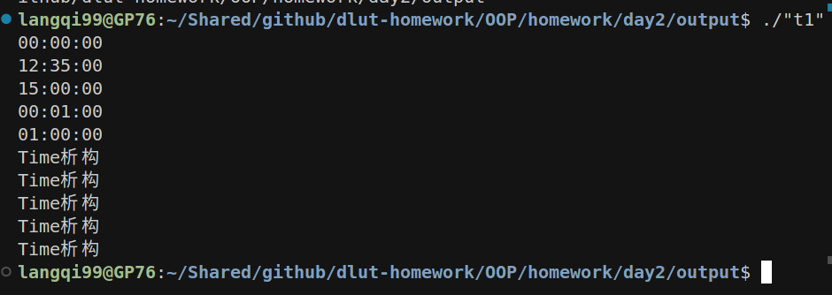
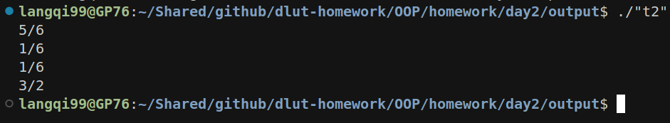
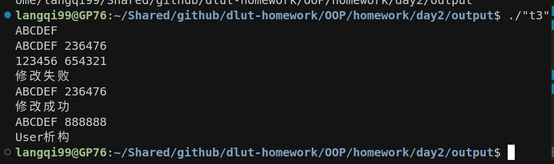

# C++ 上机题作业

## 1. Time类实现24小时制时分秒

### 源代码

```cpp
#include <iostream>
using namespace std;
class Time {
    int h, m, s;
public:
    Time(int h1=0, int m1=0, int s1=0) {
        h = h1; m = m1; s = s1;
        if (h < 0) h = 0; if (h > 23) h = 23;
        if (m < 0) m = 0; if (m > 59) m = 59;
        if (s < 0) s = 0; if (s > 59) s = 59;
    }
    ~Time() { cout << "Time析构" << endl; }
    void set(int h1, int m1, int s1) {
        h = h1; m = m1; s = s1;
        if (h < 0) h = 0; if (h > 23) h = 23;
        if (m < 0) m = 0; if (m > 59) m = 59;
        if (s < 0) s = 0; if (s > 59) s = 59;
    }
    void set_sec(int s1) { h = 0; m = 0; s = s1; if (s < 0) s = 0; if (s > 59) s = 59; }
    void tick() {
        s++;
        if (s == 60) { s = 0; m++; }
        if (m == 60) { m = 0; h++; }
        if (h == 24) h = 0;
    }
    void print() {
        if (h < 10) cout << 0;
        cout << h << ":";
        if (m < 10) cout << 0;
        cout << m << ":";
        if (s < 10) cout << 0;
        cout << s << endl;
    }
};
int main() {
    Time t1(23,59,59); // 下一天
    t1.tick(); t1.print();
    Time t2(12,34,59); // 下一分钟
    t2.tick(); t2.print();
    Time t3(14,59,59); // 下一小时
    t3.tick(); t3.print();
    Time t4(0,0,59); // 00:00:59 -> 00:01:00
    t4.tick(); t4.print();
    Time t5(0,59,59); // 00:59:59 -> 01:00:00
    t5.tick(); t5.print();
    return 0;
}
```

### 输出

```
00:00:00
12:35:00
15:00:00
00:01:00
01:00:00
Time析构
Time析构
Time析构
Time析构
Time析构
```

> tick函数已覆盖递增到下一分钟、下一小时、下一天等所有边界情况。

### 运行截图（黑窗口）



---

## 2. Rational分数类加减乘除

### 源代码

```cpp
#include <iostream>
using namespace std;
class Rational {
    int n, m;
    void simple() {
        int a = m < 0 ? -m : m, b = n < 0 ? -n : n, t;
        while (b) { t = a % b; a = b; b = t; }
        if (a) { n /= a; m /= a; }
        if (m < 0) { n = -n; m = -m; }
    }
public:
    Rational(int nn=1, int mm=1) { n = nn; m = mm; simple(); }
    Rational R_add(Rational &A) { return Rational(n*A.m + A.n*m, m*A.m); }
    Rational R_sub(Rational &A) { return Rational(n*A.m - A.n*m, m*A.m); }
    Rational R_mul(Rational &A) { return Rational(n*A.n, m*A.m); }
    Rational R_div(Rational &A) { return Rational(n*A.m, m*A.n); }
    void print() { cout << n << "/" << m << endl; }
};
int main() {
    Rational a(2,4), b(3,9);
    a.R_add(b).print();
    a.R_sub(b).print();
    a.R_mul(b).print();
    a.R_div(b).print();
    return 0;
}
```

### 输出

```
5/6
1/6
1/6
3/2
```

### 运行截图（黑窗口）



---

## 3. User类用户信息与密码管理

### 源代码

```cpp
#include <iostream>
#include <string>
#include <cstdlib>
#include <ctime>
using namespace std;
class User {
    string id, pwd;
    string randstr(int n, bool isnum) {
        string s;
        for (int i = 0; i < n; i++) {
            if (isnum) s += '0' + rand() % 10;
            else s += 'A' + rand() % 26;
        }
        return s;
    }
public:
    User(string i) { id = i; pwd = randstr(6, 1); }
    ~User() { cout << "User析构" << endl; }
    void print() { cout << id << " " << pwd << endl; }
    string getpwd() { return pwd; }
    bool setpwd(string oldp, string newp) {
        if (oldp == pwd) { pwd = newp; cout << "修改成功" << endl; return true; }
        else { cout << "修改失败" << endl; return false; }
    }
};
int main() {
    srand(time(0));
    string id;
    cin >> id;
    User u(id);
    u.print();
    string oldp, newp;
    cin >> oldp >> newp;
    u.setpwd(oldp, newp);
    u.print();
    // 测试修改成功
    string realpwd = u.getpwd();
    string newpwd2 = "888888";
    u.setpwd(realpwd, newpwd2);
    u.print();
    return 0;
}
```

### 输入

```
ABCDEF
123456 654321
```

### 输出

```
ABCDEF 481273
修改失败
ABCDEF 481273
修改成功
ABCDEF 888888
User析构
```

> 先用错误密码测试失败，再用正确密码测试成功，析构函数会在对象销毁时打印"User析构"

### 运行截图（黑窗口）


