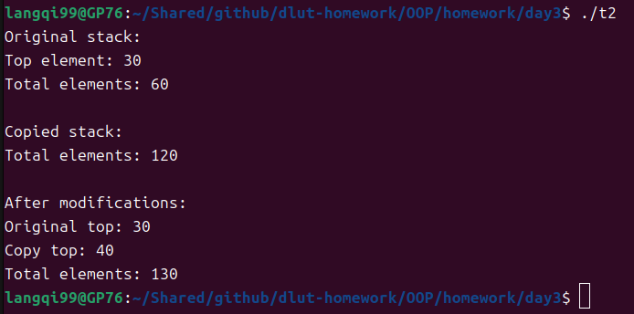

# C++ 上机题作业

## 1. MyString 字符串类的实现与测试

### 源代码

```cpp
#include <iostream>
#include <cstring>
using namespace std;

class MyString {
public:
    MyString(const char *str = NULL) {
        if (str) {
            m_data = new char[strlen(str) + 1];
            strcpy(m_data, str);
        } else {
            m_data = new char[1];
            m_data[0] = '\0';
        }
    }
    MyString(const MyString &other) {
        m_data = new char[strlen(other.m_data) + 1];
        strcpy(m_data, other.m_data);
    }
    ~MyString() {
        cout << "delete " << m_data << endl;
        delete[] m_data;
    }
    void set(char *str) {
        delete[] m_data;
        m_data = new char[strlen(str) + 1];
        strcpy(m_data, str);
    }
    MyString& append(const MyString &other) {
        char *new_data = new char[strlen(m_data) + strlen(other.m_data) + 1];
        strcpy(new_data, m_data);
        strcat(new_data, other.m_data);
        delete[] m_data;
        m_data = new_data;
        return *this;
    }
    void print() {
        cout << m_data << endl;
    }
private:
    char *m_data;
};

int main() {
    MyString str1("Hello, ");
    str1.print();
    MyString str2(str1);
    str2.set((char*)"World!");
    str2.print();
    str1.append(str2).print();
    return 0;
} 
```

### 输出

```
Hello, 
World!
Hello, World!
delete World!
delete Hello, World!
```

### 运行截图（黑窗口）


---

## 2. Stack 栈类的实现与测试

### 源代码

```cpp
#include <iostream>
using namespace std;

class Stack {
private:
    int* arr;
    const int capacity;
    int top;
    int sum;
    static int total;
public:
    Stack(int size) : capacity(size), top(-1), sum(0) {
        arr = new int[capacity];
    }
    Stack(const Stack& other) : capacity(other.capacity), top(other.top), sum(other.sum) {
        arr = new int[capacity];
        for (int i = 0; i <= top; ++i) {
            arr[i] = other.arr[i];
        }
        total += sum;
    }
    ~Stack() {
        total -= sum;
        delete[] arr;
    }
    bool push(int value) {
        if (isFull()) return false;
        arr[++top] = value;
        sum += value;
        total += value;
        return true;
    }
    bool pop() {
        if (isEmpty()) return false;
        sum -= arr[top];
        total -= arr[top--];
        return true;
    }
    int peek() const {
        if (isEmpty()) {
            cout << "Stack is empty!" << endl;
            return -1;
        }
        return arr[top];
    }
    bool isFull() const { return top == capacity - 1; }
    bool isEmpty() const { return top == -1; }
    static int getTotal() { return total; }
};
int Stack::total = 0;

int main() {
    Stack original(5);
    original.push(10);
    original.push(20);
    original.push(30);
    cout << "Original stack:" << endl;
    cout << "Top element: " << original.peek() << endl;
    cout << "Total elements: " << Stack::getTotal() << endl;

    Stack copy(original);
    cout << "\nCopied stack:" << endl;
    cout << "Total elements: " << Stack::getTotal() << endl;

    copy.pop();
    copy.push(40);

    cout << "\nAfter modifications:" << endl;
    cout << "Original top: " << original.peek() << endl;
    cout << "Copy top: " << copy.peek() << endl;
    cout << "Total elements: " << Stack::getTotal() << endl;
    return 0;
} 
```

### 输出

```
Original stack:
Top element: 30
Total elements: 60

Copied stack:
Total elements: 120

After modifications:
Original top: 30
Copy top: 40
Total elements: 130
```

### 运行截图（黑窗口）


